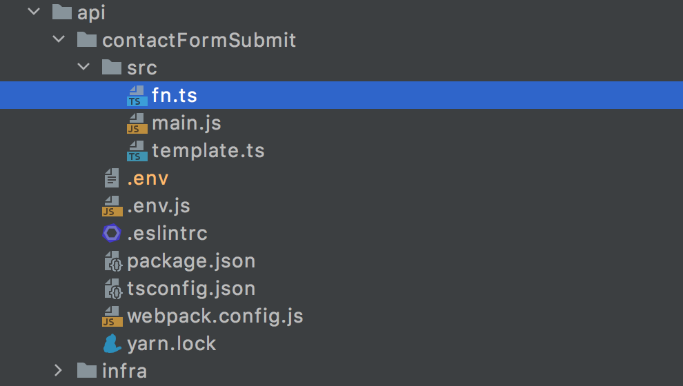

import { Container } from 'components/Container';

One fine day I have decided to have a contact form for one of my Jamstack-based websites. The goal was to have two simple fields and a button. Upon submitting the form I was supposed to receive an email.

Since the project was non-profitable, the aim was to do everything in the cheapest way possible. Ideally, free of charge.

## Step 0: picking the tech stack {a}

👉 Probably it could be wiser to use a No-Code solution, like many people do. But the solution would definitely loose in flexibility, and besides, I am an engineer, I code because I can! 💪

👉 Since I don't have any SMTP server laying around just like, to send mail I needed to find a provider. Google SMTP was off the table due to its complexity. I wanted something simpler.
Among tons of really good services I picked one called `Sendinblue`. They had a more than generous free tariff to offer: up to 300 free emails a day. Well, just because I am not a rockstar, there is no reason to expect 1k fan letters per a day, so Sendinblue was a go for me.

👉 Of course I could not call the provider endpoint directly from the browser, due to the obvious security reasons. I had to make a proxy endpoint.
Eventually I chose `AWS Lambda`, hosting everything in the cloud. The reasons behind the decision:

* I was not expecting heavy traffic, so Lambda would remain dormant most of the time, unlike EC2.
* I could have, however, deployed a docker image to Heroku. But a free container sleeps after N minutes of inactivity too, and it takes quite significant amount of time to wake it up. There would be noticeable latency when submitting the form.
* Amazon offers amazing 12-months free tier for Serverless.

👉 I never do manual infrastructure setup through the UI of a cloud provider. I believe that infrastructure-as-code is the right way to do the job.
I was using the `Serverless` framework to deploy my lambdas before. Today I try making everything with `Terraform` - the leading tool for the infrastructure maintenance.

👉 Choosing `React` for the UI part was obvious, because the website was already in React.

## Step 1: The code and the function {a}

The website was based on Gatsby, so I've put everything into the `api/` folder, like this:

The lambda itself is fairly simple. It just calls the Sendinblue API having the API_KEY provided. Sendinblue also has
[an official SDK](https://www.npmjs.com/package/sib-api-v3-sdk), which I found to be quite over-engineered and impractical to use, since I only needed to make one POST call.

Ah, how I like good old `Axios`. Axios, you helped me out so many times!

~~~js file:api/contactFormSubmit/src/fn.ts
import axios from 'axios';
import { compile } from 'pug';
import { template } from './template';

const composeMessage = compile(template);

export const fn = async (message: string, contact: string) => {
    const htmlContent = composeMessage({
        message,
        contact,
    });

    return axios.post(
        'https://api.sendinblue.com/v3/smtp/email',
        {
            sender: {
                name: '🤖 Mr. Robot',
                email: 'mrrobot@mywebsite.ru',
            },
            to: [
                {
                    // replace this with your own data
                    email: 'my.email@gmail.com',
                    // and that one too
                    name: 'My name',
                },
            ],
            subject: 'New message from MyWebsite!',
            htmlContent,
        },
        {
            headers: {
                'Content-Type': 'application/json',
                Accept: 'application/json',
                'api-key': process.env.SENDIN_BLUE_API,
            },
        },
    );
};``
~~~

The templating was done with `Pug`, so I didn't have to worry about manual escaping and anything.

~~~js file:api/contactFormSubmit/src/template.ts
export const template = `
html
    body
        h1 New message from MyWebsite!
        h2 The message:
        p #{message}
        if contact
            h3 How to contact the author:
            p #{contact}
`;
~~~

The handler for the lambda was located in a separate file. This way I could run the function itself locally, if required.

~~~js file:api/contactFormSubmit/src/main.js
import { fn } from './fn';

const makeResponse = (code, message = 'Ok') => {
    if (code === 400) {
        message = 'Go away hacker';
    } else if (code === 500) {
        message = 'Oooops';
    }
    return {
        statusCode: code,
        headers: {
            'Content-Type': 'text/html; charset=utf-8',
            'Access-Control-Allow-Origin': process.env.CORS,
        },
        body: message,
    };
};

export const handler = (event, context, callback) => {
    const { body: rawBody } = event;

    let body = {};
    try {
        body = JSON.parse(rawBody);
    } catch (error) {
        return callback(null, makeResponse(400));
    }

    const { contact, message } = body;

    fn(message, contact)
        .then(() => {
            callback(null, makeResponse(200));
        })
        .catch((error) => {
            console.error(error);
            callback(null, makeResponse(500));
        });

    return true;
};
~~~

I typically build everything with Webpack. One day I might have to learn other bundlers, but I am just such an old timer.
Normally I inject the environment variables with the `Dotenv` plugin. But because setting `systemvars` to `true` during the production build is sort of creepy, I invented nothing better than just using the `Define` plugin instead. After all, `create-react-app` does so, why should not I?

~~~js file:api/contactFormSubmit/webpack.config.js
const path = require('path');
const Dotenv = require('dotenv-webpack');
const { DefinePlugin } = require('webpack');

const allowedEnvVariables = ['SENDIN_BLUE_API', 'CORS'];

const getEnv = () => {
    const result = [];

    allowedEnvVariables.forEach((variableName) => {
        if (
            variableName in process.env &&
            process.env[variableName] !== undefined
        ) {
            result[`process.env.${variableName}`] =
                '"' + process.env[variableName] + '"';
        }
    });

    return result;
};

module.exports = {
    mode: 'production',
    entry: './src/main.js',
    output: {
        filename: './main.js',
        path: path.resolve(__dirname, 'build'),
        libraryTarget: 'umd',
    },
    resolve: {
        extensions: ['.ts', '.js'],
    },
    target: 'node',
    module: {
        rules: [
            {
                test: /\.ts$/,
                loader: 'ts-loader',
                exclude: /node_modules/,
            },
        ],
    },
    plugins: [
        new Dotenv(),
        new DefinePlugin(getEnv()),
    ],
};
~~~

You may be also interested in the `package.json`, just in case.

~~~js file:api/contactFormSubmit/package.json
{
    "name": "sendContactFormEmail",
    "version": "1.0.0",
    "main": "index.js",
    "license": "MIT",
    "scripts": {
        "build": "webpack --config webpack.config.js --mode production"
    },
    "devDependencies": {
        "@types/cors": "^2.8.10",
        "@types/ejs": "^3.0.6",
        "@types/express": "^4.17.11",
        "@types/pug": "^2.0.4",
        "dotenv-cli": "^4.0.0",
        "dotenv-webpack": "^7.0.2",
        "express": "^4.17.1",
        "ts-loader": "^8.1.0",
        "ts-node": "^9.1.1",
        "typescript": "^4.2.3",
        "webpack": "^5.30.0",
        "webpack-cli": "^4.6.0",
        "webpack-node-externals": "^2.5.2"
    },
    "dependencies": {
        "axios": "^0.21.1",
        "cors": "^2.8.5",
        "pug": "^3.0.2"
    }
}
~~~

Okay, so the coding part is pretty much done. Not so difficult, huh? In the next part I will cover the way I did the infrastructure deployment. See you again pretty soon!
