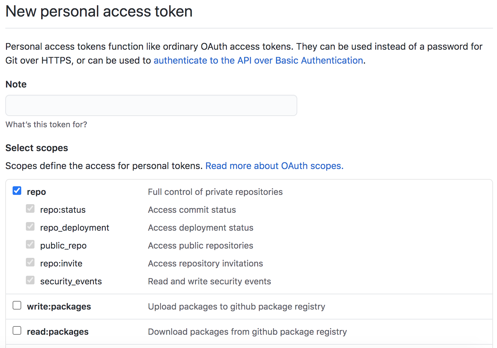
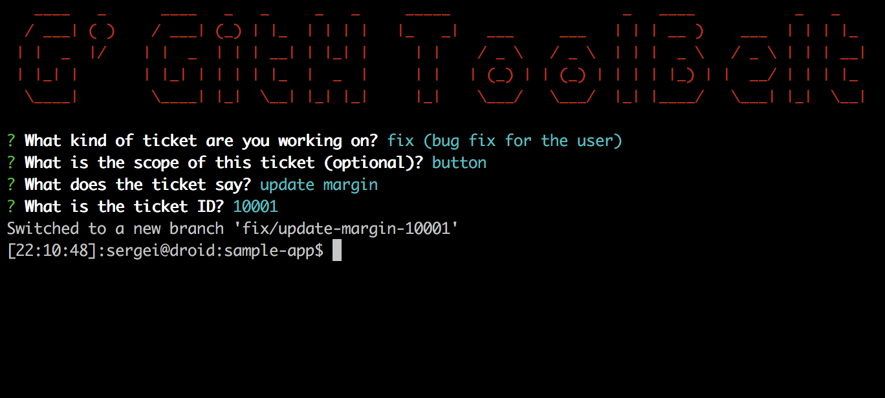
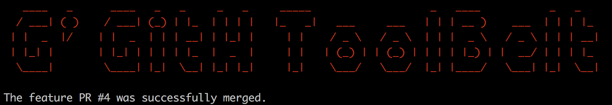
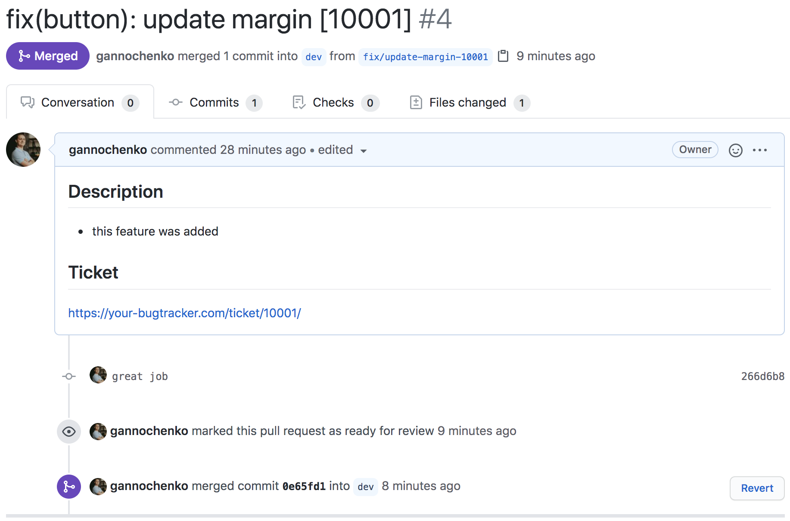
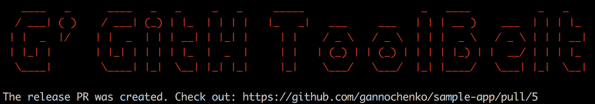
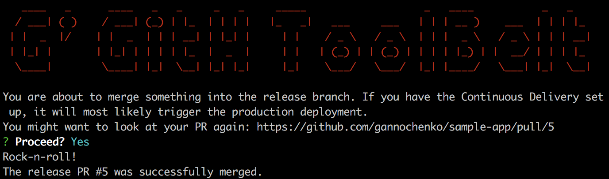
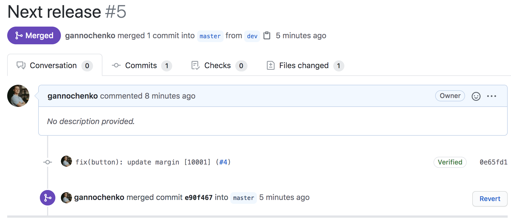

import { Container } from 'components/Container';
import { Copyright } from 'components/Copyright';
import { Align } from 'components/Align';

Time is not money. Time is a more precious thing. I really like automating the day-to-day routine, so after getting tired of constant misclicks and repeated keyboard work, decided to build a tool that saves a couple of minutes.

In most of my projects I have the following pipeline:

👉 each feature is developed in a *feature branch* named like `[feat|fix|...]/ticket-text-ticket-id`, 
👉 the ongoing release consists of many features *squashed* into `dev`, 
👉 the deployment happens when `dev` gets *merged* into `master`. 

If you have the same workflow as mine, let me show how the `GitHub Toolbelt` helped me out to automate the thing.

<Align>

<Copyright source="https://giphy.com/gifs/doctorwho-doctor-who-dr-patrick-troughton-SVI9nccwH3sz5XJhbK" authorPrefix="Picture by" author="doctorwho.tv" sourceText="Giphy" />

</Align>

## Step -1: installation

The tool is written in `node`, so you have to [have node runtime installed](https://github.com/nvm-sh/nvm). Also I still prefer [yarn](https://yarnpkg.com/) over npm. If you are a JS developer, you already should have all of this on-board anyway.

So, to install the package:

~~~bash
yarn global add @gannochenko/gbelt
~~~

or, to install just for the current user:

~~~bash
mkdir ~/.node
yarn global add @gannochenko/gbelt --prefix ~/.node
printf "\nexport PATH=\$PATH:\$HOME/.node/bin\n" >> ~/.bash_profile # .bashrc for *nix
source ~/.bash_profile # .bashrc for *nix
~~~

After doing so, a CLI command `gbelt` should become available:

~~~bash
gbelt -h
~~~

## Step 0: obtain a GitHub token

To call GitHub endpoints, I need to [issue a token first](https://github.com/settings/tokens/new), with the following scope:

Then I put the token to the `GBELT_GITHUB_TOKEN` env variable:

~~~bash
printf "\nexport GBELT_GITHUB_TOKEN=TOKEN_VALUE\n" >> ~/.bash_profile
source ~/.bash_profile # bashrc for *nix
~~~

## Step 1: create a local feature branch with a pretty name

Lets assume I am in the `dev` branch now, and about to begin developing a new contribution. I need a branch for that, so I type

~~~bash
gbelt feature branch
~~~

The app will ask me then what kind of contribution is that: feature, fix or something else.
The next question will be to describe the update, and provide a ticket number.

<Align>

</Align>

The exact answers get stored in the description of the branch as serialized JSON. The command

~~~sh
git config "branch.fix/update-margin-10001.description"
~~~

will give me

~~~text
{"type":"fix","scope":"button","title":"update margin","id":"10001"}
~~~

## Step 2: create a feature Pull Request

Now that I made some changes in the project, I can now create a PR from `fix/update-margin-10001` to the `dev`.

I commit and push first, like always:

~~~bash
git commit -am "great job"
git push origin fix/update-margin-10001
~~~

Then to create a PR, I just type

~~~bash
gbelt feature create
~~~

Hopefully, if everything is arright, I am able to see this message:

**Mega tip** 👉 if somewhere in the root of the project there is a file called `.github/PULL_REQUEST_TEMPLATE.md`, its content will be used for the PR description, just like Github itself does that. The placeholder `#TICKET_ID#` will be replaced meanwhile:

~~~text
## Description

* this feature was added

## Ticket 
https://your-bugtracker.com/ticket/#TICKET_ID#/
~~~

## Step 3: merge the feature PR after its approval

So instead of going at Github and pressing buttons there, `gbelt` allows to `squash-and-merge` the PR from the command line. I just type

~~~bash
gbelt feature merge
~~~

And here we go (yeh, the PR number is different, cos I kind of screwed up the previous two attempts while creating this post):

## Step 4: create a release PR for production

It is almost like with features, but just a different command:

~~~bash
gbelt release create
~~~

## Step 5: merge the release PR

So the last part is tricky. Since the release PR is able to trigger the Continuous Delivery pipeline, it can potentially do harmful things.

~~~bash
gbelt release merge
~~~

Therefore, the confirmation for this action is required from my side:

Here goes the PR. Note that the PR was `merged`, not `squashed`, so I allow CD to work our properly with all that stuff with tags and changelog.

And that is it! Since this release is out, I can now go to step 1 and create new features, and then do everything all over again.

## Config

Of course there is a possibility to config the tool :) Just create a file `.gbeltrc` in your project root folder, with the following content:

~~~js
module.exports = {
    developmentBranch: 'dev', // the main dev branch where all the features go
    releaseBranch: 'master', // the branch you run deployments from
    ticketIdPrefix: 'GT-', // if you work somewhere like Jira and you need you tickets to be auto-prefixed
    useDraftPR: false, // create a draft feature PR when possible
    releasePRName: 'New release', // the default name for the release PR
};
~~~

---

## Conclusion

Of course, all of this can be done manually via GitHub web interface. In time the routine actions turn into a habit and basically work on a subconscious level.

And yet we are human, no matter how careful we are, there is always a chance of making a mistake.
Being part of a team, you most certainly don't want to mess up with the development pipeline, as well as with the production deployment. So, if there is a way to automate your actions, to have some tool that can give a rap over the knuckles when needed, it could come handy indeed.

### Possible improvements

Sure thing the tool is not perfect. I still need to have a way to ensure all the checks are green and the PR is ready to merge before actually merge it. This is something I am gonna improve soon.

---

### Credits

* Gorgeous [GitHub REST API](https://docs.github.com/en/rest) which made this all possible

### Other great projects

* [Official GitHub CLI tool](https://cli.github.com/) that solves more generic task

Thanks for reading! Don't mess up with your dev process ;)
