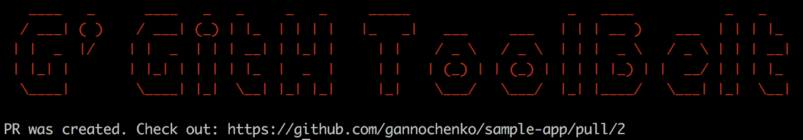

import { Container } from 'components/Container';
import { Copyright } from 'components/Copyright';
import { Align } from 'components/Align';

Time is not money. Time is a more precious thing. Getting tired of constant mis-clicks and repeated keyboard work, decided to build a tool that saves some.

In most of my projects I have the following pipeline:

👉 each feature is developed in a *feature branch* named like `[feat|fix|...]/ticket-text-ticket-id`, 
👉 the ongoing release consists of many features *squashed* into `dev`, 
👉 the deployment happens when `dev` gets *merged* into `master`. 

If you have the same workflow as mine, let me show how GitHub Toolbelt helps me out in automation of the GitHub daily routine.

<Align>

<Copyright source="https://giphy.com/gifs/doctorwho-doctor-who-dr-patrick-troughton-SVI9nccwH3sz5XJhbK" authorPrefix="Picture by" author="doctorwho.tv" sourceText="Giphy" />

</Align>

## Step 0: installation

The thing is written in `node`, so you have to [have node runtime installed](https://github.com/nvm-sh/nvm). Also I still prefer [yarn](https://yarnpkg.com/) over npm. If you are a JS developer, you already should have all of this on-board anyway.

So, to install the package:

~~~bash
yarn global add @gannochenko/gbelt
~~~

or, to install just for the current user:

~~~bash
mkdir ~/.node
yarn global add @gannochenko/gbelt --prefix ~/.node
printf "\nexport PATH=\$PATH:\$HOME/.node/bin\n" >> ~/.bash_profile # .bashrc for *nix
source ~/.bash_profile # .bashrc for *nix
~~~

After doing so, a CLI command `gbelt` should become available:

~~~bash
gbelt -h
~~~

## Step 1: create a local feature branch with a pretty name

Lets assume I am in the `dev` branch now, and about to begin developing a new contribution. I need a branch for that, so I type

~~~bash
gbelt feature branch
~~~

The app will ask me then what kind of contribution is that: feature, fix or something else.
The next question will be to describe the update, and provide a ticket number.

<Align>

</Align>

The exact answers get stored in description of the branch as serialized JSON. The command

~~~sh
git config "branch.fix/update-margin-10001.description"
~~~

will give me

~~~text
{"type":"fix","scope":"button","title":"update margin","id":"10001"}
~~~

## Step 2: create a feature Pull Request

Now that I made some changes in the project, I can now create a PR from `fix/update-margin-10001` to the `dev`.

I commit and push first, like always:

~~~bash
git commit -am "great job"
git push origin fix/update-margin-10001
~~~

Then to crate a PR, I just type

~~~bash
gbelt feature create
~~~

Hopefully, if everything is arright, I am able to see this message:

**Mega tip** 👉 if somewhere in the root of the project there is a file called `.github/PULL_REQUEST_TEMPLATE.md`, its content will be used for the PR description, just like Github itself does that. The placeholder `#TICKET_ID#` will be replaced meanwhile:

~~~text
## Description

* this feature was added

## Ticket 
https://your-bugtracker.com/ticket/#TICKET_ID#/
~~~

## Step 3: merge the **feature PR** after it's approval

So instead of going at github and pressing buttons there, `gbelt` allows to `squash-and-merge` the PR from the command line. I just type

~~~bash
gbelt feature merge
~~~

And here we go (yeh, the PR number is different, cos I kind of screwed up the previous two attempts while creating this post):

## Step 4: create a **release PR** for production deployment (`dev` -> `master`)

...so the continuous delivery can do its work

## Step 5: merge the **release PR** to `master`
 
