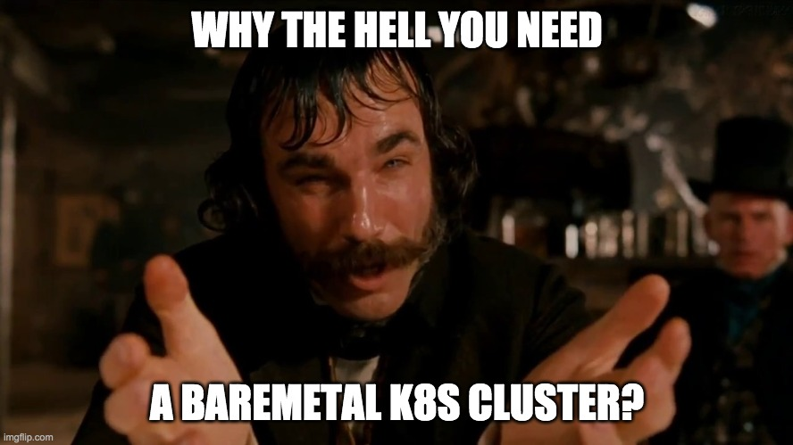

Maybe you already have a question.

Well, because...

* It is a good opportunity to receive close-to-production experience with K8s.
* You don't have to sell your kidney to run AKS/GKE/EKS as a hobbyist or private explorer.
* `Minikube` or other kind of local installations seems unsatisfying.
* It is fun. I promise 🤞

What you should understand before we go further.

* It will not be a production-ready environment for mature commercial projects.
* Nevertheless, it will be good enough for hobby projects, idea proof of concept, learning and exploration.
* You will not get any control panel, only raw `kubectl`.
* To observe the pods themselves there will be only [Prometheus](https://prometheus.io/) and Grafana.

## Other projects

* [kops](https://kops.sigs.k8s.io/) - K8s installer on AWS/GCE/OpenStack/Digital Ocean/Spot Ocean
