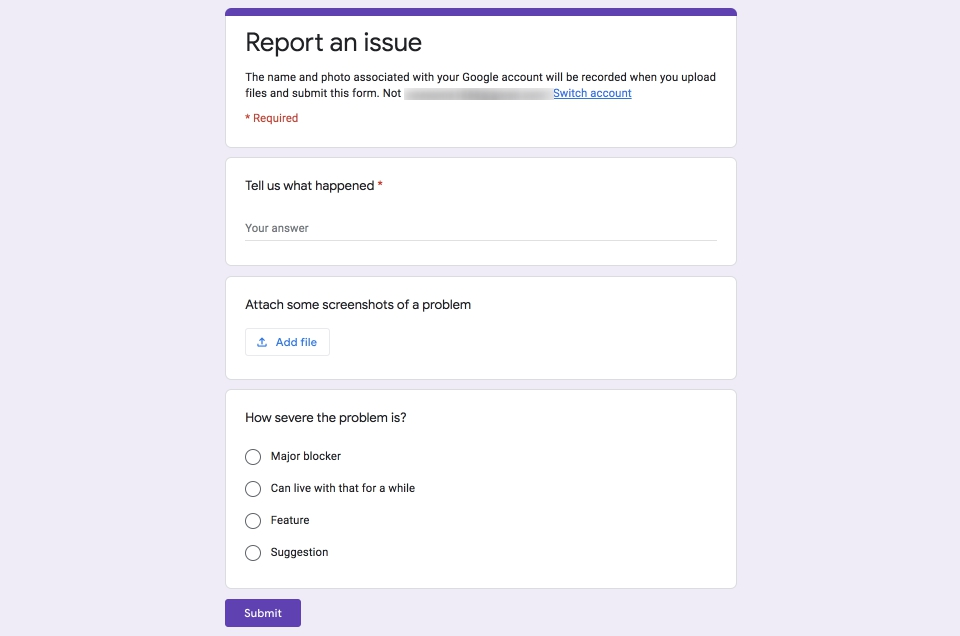
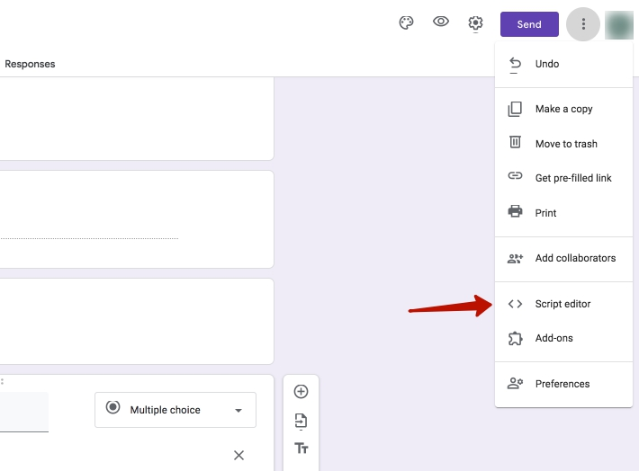
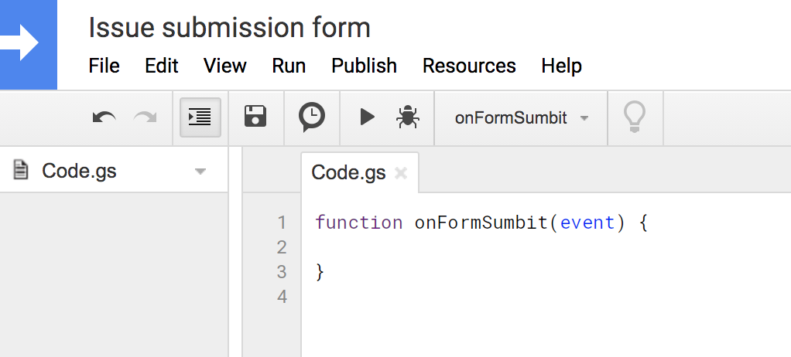
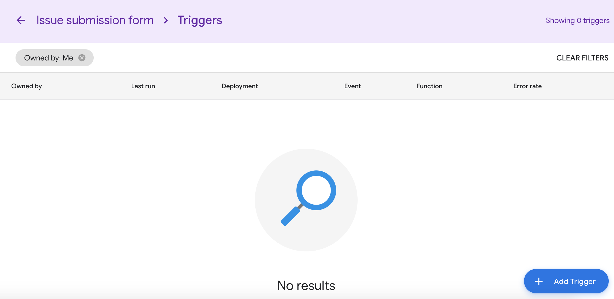
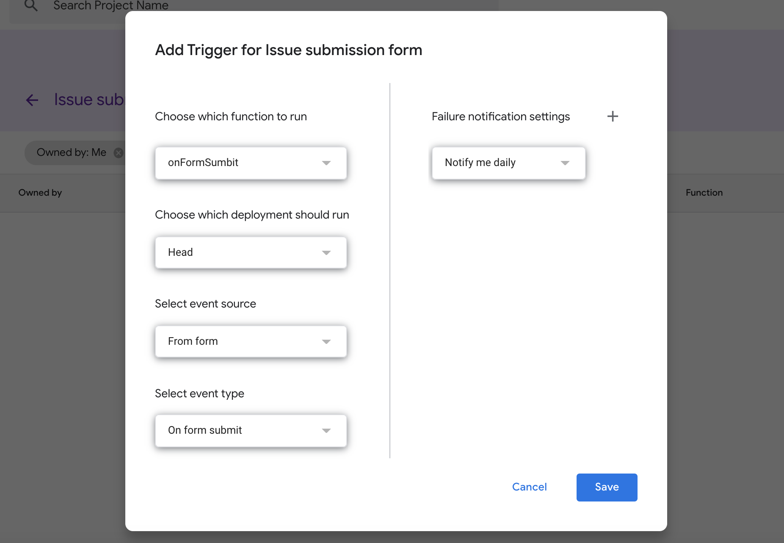
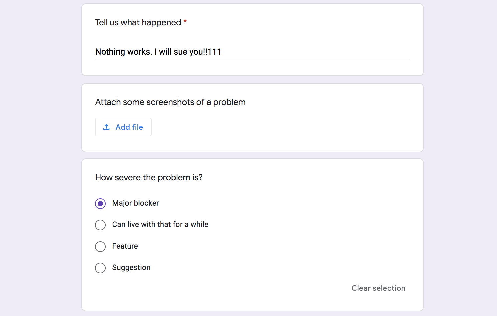
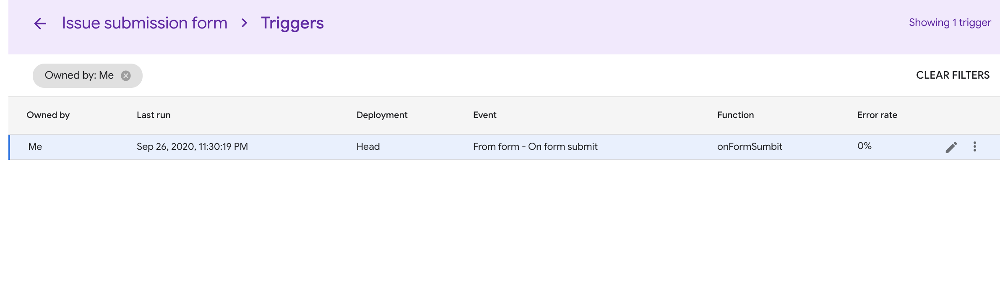
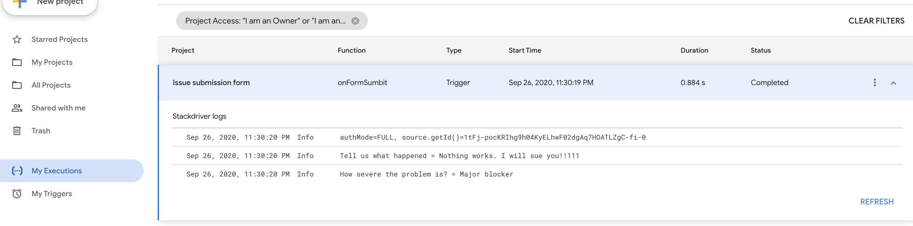
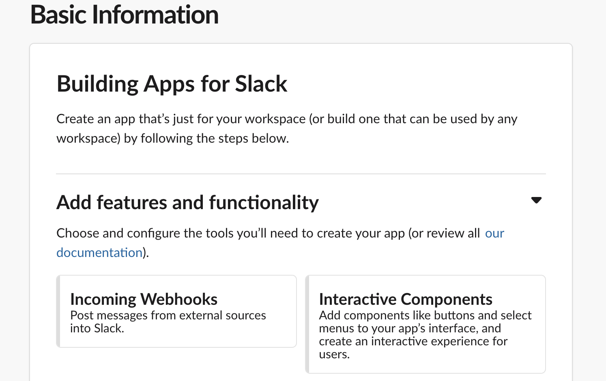
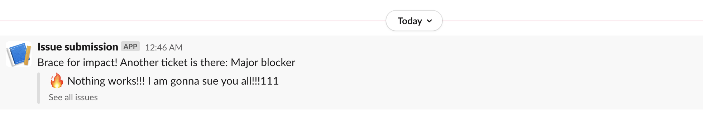

import { Container, Copyright, Align, Comment } from 'components';

One day came, and I have faced a challenge of how to post a new message on Slack when someone submits a Google Form. Well, not a challenge really.
At the beginning I thought to just plug `Zappier` in.

But then I asked myself "I am a developer, am I not? Could it be done by using glue, pencils and a screwdriver?" And in fact, it could be.

<Align>

<Copyright source="https://giphy.com/gifs/ashvsevildead-reaction-3o75244asK5HGLmo9O" authorPrefix="Picture by" author="Ash vs Evil Dead" sourceText="Giphy" />

</Align>

## Step 1: Create a form

So yeah, here goes my form.

<Align>

</Align>

I know, I know, it is better to have a fully-featured bugtracker here, but I wanted to keep it simple for now.
So the idea would be: whenever someone submits the form, I want to receive a message in Slack right away.

## Step 2: A little bit of engineering

In the form editor there is a link called `Script editor`:

<Align>

</Align>

If I press it, a simple IDE will appear.

<Align>

</Align>

Meet `Google Script`!

`GS` is sort of like `VBA` (if you know what it is 🤪), but with `ECMAScript` syntax. I got an impression that `GS` was initially built to automate precisely Google Sheets, but for other types of documents it also can do a trick or two.

Replace the content of the tab with the following listing

~~~js
function onFormSumbit(event) {
    Logger.log("authMode=%s, source.getId()=%s", event.authMode, event.source.getId());

    var items = event.response.getItemResponses();
    
    for (var i in items) {
        const item = items[i];
        
        Logger.log("%s = %s", item.getItem().getTitle(), item.getResponse());
    }
}
~~~

and press the `Save` button.

For now, this function is just a function. I can try to run the script by pressing the `Run` button, but I will only get an error message saying that `event` is undefined.
I need to bind the function to the form submission event.

To do that, I go to `Edit` ➡️ `Current project's triggers` menu item. In the list of triggers I hit `+ Add trigger` button located at the bottom.

<Align>

</Align>

A form will pop up then. I check if the function name is right, and also change `Select event type` to `On form submit`.

<Align>

</Align>

After I hit `Save`, I will be asked to grant permissions. Usual deal. In the list of triggers I can now see my trigger that was never executed before.

I go back to my form and fill it up, then submit:

<Align>

</Align>

In the list of triggers I can see that it was just executed a few moments ago:

<Align>

</Align>

If I proceed to `My executions` section, I can get the output of the script:

<Align>

</Align>

Wow, it works! What a twist!

## Step 3: Wire up Slack

Before I go further, I need to set `Slack` up a bit. So, `Slack` allows to post a message to a channel, by providing a secret URL (`Webhook`). To create such `webhook` I need to create a `Slack` application first.
So I go to [Slack API panel](https://api.slack.com/apps/) and hit `Create an App`. Here I need to specify the app name and the workspace.

When the app is ready, I go to `Add features and functionality` and then click on `Incoming Webhooks`.

<Align>

</Align>

If `Incoming Webhooks` were not activated before, I activate them now. Then I scroll down to the list of hooks and hit the `Add new Webhook to Workspace` button.
I need to specify the channel I am going to post the messages on. When all of this is done, I can see my hook in the list, and copy it's URL from there.

The URL should have a format of `https://hooks.slack.com/services/XXXXXXXX/YYYYYYY/ZZZZZZZZZZZZZZZZ`.

## Step 4: The code

Allright!! Time to write some cool stuff here.

I go back to my `GS` code editor and change the function like this:

~~~js
function onFormSumbit(event) {
    var items = event.response.getItemResponses();
    
    var summary = '';
    var severity = '';
    
    for (var i in items) {
        var item = items[i];
        var title = item.getItem().getTitle();
        var value = item.getResponse();
        
        if (title === 'Tell us what happened') {
            summary = value;
        } else if (title === 'How severe the problem is?') {
            severity = value;
        }
    }
    
    if (summary) {
        postMessage(summary, severity);
    }
}

function postMessage(summary, severity) {
    var message = {
        "channel" : "react-calendar",
        "text" : "Brace for impact! Another ticket is there: "+severity,
        "attachments": [{
            "text": ":fire: "+summary,
            "footer": "<https://docs.google.com/spreadsheets/d/XXXXXXXX/edit|See all issues>",
            "mrkdwn_in": ["text"]
        }]
    }

    var options = {
        "method" : "post",
        "contentType" : "application/json",
        "payload" : JSON.stringify(message)
    };

    return UrlFetchApp.fetch("https://hooks.slack.com/services/XXXXXXXX/YYYYYYY/ZZZZZZZZZZZZZZZZ", options);
}
~~~

⚠️⚠️⚠️ Please replace my stub URL with your own one! There is also a link to a spreadsheet with all the submissions, and it's URL is stubbed as well.

Well it is not a very brilliant code though, and it most definitely can be improved. Later. For now I save the code in the editor and submit the form once again.

Aaaaaand nothing works. In the ouput of the execution there is an error `Exception: You do not have permission to call UrlFetchApp.fetch.`
Well this happens because I created a trigger when there was no `UrlFetchApp.fetch()` call in the code. Since it needs elevated permission, my trigger does not work anymore.

I need:

1. to revoke [permissions](https://security.google.com/settings/security/permissions) of the script in my Google account,
2. to kill the trigger and re-create it again (Google may get a bit paranoid and warn me that I should not trust the code I wrote a couple of minutes ago. And heck, Google is wise in that one).

As soon as this is done, I try to re-submit the form one more time.

<Align>

</Align>

Oh. My. Glob. It worked! Now I am not gonna miss another bug report ever!

---

## Conclusion

Sometimes instead of rushing into a third-party solution which acts as an inter-service conduct, it can be preferable to utilise your engineering skills. This is always a trade-off, but if you have time, then why not dare?
